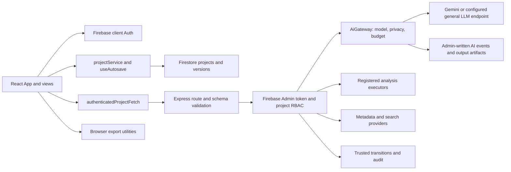

# TehqIQ maintainer architecture

Source inspection: 2026-09-25, TQ-VSC-097. This describes the current working tree, including the TQ-VSC-096 cleanup. Start with [operations](TEHQIQ_OPERATIONS.md) for commands and configuration. Historical audit reports are evidence for their recorded runs, not proof that every library is connected to the application.

## 1. Running application and source map

[src/main.tsx](../src/main.tsx) mounts React; [App.tsx](../src/App.tsx) owns the active `ProjectState`, ten-step hash navigation, project selection, and modal state. [types.ts](../src/types.ts) defines persisted research records. Initial state comes from the explicitly marked `createDemoProject()` in [demoProject.ts](../src/data/demoProject.ts); `createEmptyProject()` creates real projects without that fixture data. The prototype/not-approved-for-real-research banner remains mounted.

[server.ts](../server.ts) starts Express on `0.0.0.0:3000`, loads `.env` with `dotenv.config()`, and attaches Vite middleware in development or serves `dist` when `NODE_ENV=production`. The same process serves the browser and API. There is no background job worker or general workflow-dispatch HTTP endpoint.

The diagram shows mounted call paths. Tested libraries without a current UI/server caller are identified below; their existence does not imply an operational service.

## 2. Six-stage grouping and the rendered ten-step UX

[Navigation.tsx](../src/components/Navigation.tsx) exports `RESEARCH_STAGES`, but renders `WORKFLOW_STEPS` on desktop and mobile. The six stages are a declared grouping, not six currently rendered navigation tabs. [App.tsx](../src/App.tsx) still selects content using `activeStep` values 1–10.

| Declared stage | Step IDs | Mounted content in App |
| --- | --- | --- |
| Project & Target | 1, 3 | Dashboard and research canvas; question/hypothesis builder. Outlet selection actually appears at step 2. |
| Evidence | 2, 9 | Step 2: outlet catalogue, search planner, screening, source library, gap map. Step 9: Claim Matrix and passage/sentence evidence links. |
| Method & Data | 5 | Ethics display, reporting checklist, methodology workspace, and Data Lab. |
| Analysis | 6 | Data Lab again: ingestion, variable dictionary, execution, output review. |
| Manuscript | 4, 7, 8 | Writing Studio receives filtered section subsets; step 7 also mounts revisions. |
| Review & Export | 10 | Compliance, peer review, AI ledger, and Export Centre. |

The legacy `#step-N` and named aliases are resolved by `tabToStepMap`. Some aliases identify an entire step rather than scrolling to the named module: for example, `outlets` maps to step 10 while Journal Finder is mounted at step 2. Step 9 retains the label “References” but mounts Claim Matrix. Trace actual rendering before changing route aliases. Coverage: [appViewRouting.test.ts](../src/tests/appViewRouting.test.ts), [researchStages.test.ts](../src/tests/researchStages.test.ts), [noviceResearcherUx.test.tsx](../src/tests/noviceResearcherUx.test.tsx).

## 3. Server routes and authorization

[authenticatedFetch.ts](../src/lib/authenticatedFetch.ts) obtains the current user's Firebase ID token and adds `Authorization: Bearer …` and `X-TehqIQ-Project-Id`. [authMiddleware.ts](../src/server/authMiddleware.ts) verifies the token using Admin SDK, loads `projects/{projectId}`, derives the role from `ownerUid`/`members`, checks request size and rate limits, and supplies `req.projectAuth`.

Writer roles are Owner, Corresponding Author, Co-author, Supervisor, and Statistician. “All members” additionally includes Reviewer and Viewer. The rate limiter is process-local, configured for 60 requests per actor/project/route per 60 seconds. The global JSON limit is 25 MB; routes impose smaller limits where shown.

| Method and route in server.ts | Role / body limit | Implementation |
| --- | --- | --- |
| `GET /api/health` | Public | Static process-health JSON; no dependency checks. |
| `POST /api/projects/:projectId/audit-events` | Writers, email claim / 64 KB | Validated append-only audit event for an existing entity. |
| `POST /api/projects/:projectId/transitions` | Writers, email claim / 64 KB | Admin transaction using `applyTrustedTransition`. |
| `POST /api/gemini/agent` | Writers / 1 MB | Frontend-authorized AgentRegistry contract; currently only `research-intake`. |
| `POST /api/gemini/draft-section` | Writers / 5 MB | Gateway `section-writer`, route-specific draft schema, approved-output check for Results. |
| `POST /api/gemini/peer-review` | Writers and Reviewer / 5 MB | Gateway `peer-review`, structured comments. |
| `POST /api/gemini/methodology-proposal` | Writers / 512 KB | Gateway `methodology-design`, structured methodology proposal. |
| `POST /api/sources/doi` | All members / 16 KB | Authoritative DOI lookup chain; imported source remains Unverified. |
| `POST /api/projects/:projectId/search-executions` | Writers / 128 KB | Search design compilation and provider execution. |
| `POST /api/projects/:projectId/agents/literature-retrieval` | Writers, email claim / 128 KB | Approved-plan retrieval library. |
| `POST /api/analysis/execute` | Writers / 25 MB | Enabled method lookup, optional external service, native executor, output figures/tables. |

Request and model-response validators live in [apiSchemas.ts](../src/server/apiSchemas.ts). Authentication establishes project access; it does not by itself prove that every research fact in a request body is independently verified. The draft/analysis routes accept schema-checked research context from request bodies, while trusted transitions reload stored state inside a transaction. Keep those boundaries distinct when assessing integrity.

## 4. WorkflowOrchestrator, AgentRegistry, and SectionContracts

[workflowOrchestrator.ts](../src/server/workflowOrchestrator.ts) implements `WorkflowOrchestrator.plan()`: a deterministic prerequisite checker for Empirical, Systematic Review, Qualitative, Existing Dataset, and Existing Methodology workflows. It checks stage, role, allowed artifact keys, and required artifact states. It returns either missing prerequisites or a dispatch plan with `approvalRequired: true` and `automaticNextAgent: null`.

It does **not** execute agents, persist outputs, or authenticate callers. Its `outputStorage` strings such as `workflow/manuscript/section-proposals` are dispatch metadata, not automatically created Firestore collections. Repository call-site inspection finds its use in tests, including the three workflow fixtures, but no import in the running server or App. The comment “AI Agent Orchestrator Endpoint” in server.ts refers to the separate generic gateway route, not this class.

[agentRegistry.ts](../src/server/agentRegistry.ts) defines 19 contracts: purpose, inputs, tools, schema metadata, model tier, workflow states, review requirement, roles, and prohibitions. The generic route calls `authorizeFrontend()`; dedicated AI routes use fixed agent IDs and the gateway rechecks role/input/tool constraints. Contract descriptions and `requiredWorkflowStates` are not a substitute for executing the orchestrator or validating artifact contents. Deterministic agents are rejected by the language-model gateway.

[manuscriptSectionContracts.ts](../src/lib/manuscriptSectionContracts.ts) defines nine contracts: Introduction, Literature Review, Methods, Results, Discussion, Conclusion, Abstract, Title, and Keywords. `validateSectionInputs()` checks allowed artifacts, review states, and real/demo isolation; `validateSectionDraftOutput()` checks the structured proposal envelope. [manuscriptSectionWriters.ts](../src/lib/manuscriptSectionWriters.ts) validates selections of exact grounded content units, source/evidence IDs, and numeric evidence. [resultsInterpretationWritingAgent.ts](../src/lib/resultsInterpretationWritingAgent.ts) selects exact approved findings and validates their numeric grounding.

These stricter writer libraries are tested but are not imported by the current `/api/gemini/draft-section` handler. The mounted [WritingStudioView.tsx](../src/components/views/WritingStudioView.tsx) uses that handler's `DraftSectionModelOutput` schema, then [aiValidationService.ts](../src/lib/aiValidationService.ts), [writingEvidence.ts](../src/lib/writingEvidence.ts), and [AiProposalModal.tsx](../src/components/AiProposalModal.tsx) for validation and researcher disposition. Tone-only formatting uses [manuscriptTone.ts](../src/lib/manuscriptTone.ts); the obsolete q1 generator was removed in TQ-VSC-096.

Tests: [workflowOrchestrator.test.ts](../src/tests/workflowOrchestrator.test.ts), [agentRegistryAdversarial.test.ts](../src/tests/agentRegistryAdversarial.test.ts), [manuscriptSectionContracts.test.ts](../src/tests/manuscriptSectionContracts.test.ts), [manuscriptSectionWriters.test.ts](../src/tests/manuscriptSectionWriters.test.ts), [resultsInterpretationWritingAgent.test.ts](../src/tests/resultsInterpretationWritingAgent.test.ts).

## 5. AI execution, privacy, cost, and ledger

[AiGateway](../src/server/aiGateway.ts) is the material model-call boundary. It validates agent/actor/input metadata, separates structured output from controlled tools, routes the provider, reserves budget, runs bounded provider attempts, validates returned JSON through the supplied validator, and records a proposal artifact. Only `GeminiAiProvider` constructs `GoogleGenAI` and calls `models.generateContent`.

[ModelRouter](../src/server/modelRouter.ts) selects FAST for standard-language agents, REVIEW for peer-review/compliance/integrity-review IDs, and MAIN otherwise. Deterministic agents are rejected before a language call. Model IDs come from configuration; the source defaults are identifiers, not assertions about provider availability.

[PrivacyAwareTaskRouter](../src/server/privacyTaskRouter.ts) reads the stored project `aiPrivacyMode`, falling back to the server environment. Every gateway task supplies sensitivity, raw-upload presence, permitted provider IDs, and preferred tier.

| Mode | Eligible provider locations and order |
| --- | --- |
| Standard Cloud | Cloud, then Private, then Local, restricted to available permitted providers. |
| Private/Hybrid | Private, then Local; Cloud only for Public/Internal tasks without raw uploads. |
| Local-Only | Local only; no cloud fallback. |

No eligible provider produces `Cannot Run Under Current Privacy Mode`. The current server constructs Gemini and a health-checked `LocalGeneralLlmEndpointAdapter`; local/private classification requires the explicit `TEHQIQ_LOCAL_LLM_LOCATION` operator setting. These policies govern gateway calls, not all network activity: Firebase, metadata searches, external analysis, and optional parser adapters have separate transports. “Local-Only” is not an offline/no-egress guarantee for the whole application.

[aiBudgetGuard.ts](../src/server/aiBudgetGuard.ts) requires versioned provider/model prices and a project or server budget policy. It reserves for maximum provider attempts, enforces budget/tier/loop constraints, and settles reported usage. Usage and reservations are keyed by **project plus actor**, in memory per server process. Restarts reset them; multiple replicas do not share limits. Missing usage remains null in gateway events but settles as zero tokens in the current cost helper, so estimated cost is not a billing reconciliation guarantee. The local LLM adapter also does not currently forward the gateway's output-token cap in its request body.

Successful calls batch-write `projects/{id}/aiGatewayEvents/{eventId}` and `aiOutputArtifacts/{artifactId}` via Admin SDK. Provider/schema failures attempt to write a failure event; authorization/privacy/budget failures before the provider try-block need not create one. Audit-write failure is explicit. The browser's `project.aiLedger` and `aiLedgerIntegrity` are a separate projection used by [AiLedgerView.tsx](../src/components/views/AiLedgerView.tsx) and disclosure checks. No general reconciliation/subscription path from the gateway collections is mounted, and the current Firestore rules have no client-read matches for those two collections. An empty browser ledger does not prove no AI use.

## 6. Literature, evidence, and retrieval

[SearchPlannerView.tsx](../src/components/views/SearchPlannerView.tsx) sends provider-specific searches to the server. [searchExecution.ts](../src/lib/searchExecution.ts) records query syntax, dates, filters, provider outcomes, counts, and returned IDs for Crossref, OpenAlex, PubMed, Europe PMC, arXiv, and DOAJ. Inspect `providerExecutions`, warnings, and errors: the outer route's completed response does not mean every provider succeeded. [literatureRetrievalAgent.ts](../src/lib/literatureRetrievalAgent.ts) adds an approved-plan retrieval boundary.

[SourceLibraryView.tsx](../src/components/views/SourceLibraryView.tsx) imports DOI metadata through the protected route; [metadataProviders.ts](../src/lib/metadataProviders.ts) tries Crossref → OpenAlex → DataCite → Europe PMC → PubMed. BibTeX/RIS/CSL JSON import uses [referenceParsers.ts](../src/lib/referenceParsers.ts). Missing-citation candidate search calls the Crossref helper from the browser. Metadata resolution is distinct from source verification, peer review, and evidence support. [sourceDeduplication.ts](../src/lib/sourceDeduplication.ts) provides deterministic source reconciliation; [specialistDiscoveryProviders.ts](../src/lib/specialistDiscoveryProviders.ts) supplies additional provider/OA helpers, not an automatic full-text acquisition system.

[LiteratureScreeningWorkbench.tsx](../src/components/views/LiteratureScreeningWorkbench.tsx) uses criterion-linked review records. [DocumentReaderModal.tsx](../src/components/views/DocumentReaderModal.tsx) displays available full text and evidence records; it does not call a PDF ingestion service.

The evidence path is `manuscript sentence → claim → ClaimEvidenceLink → EvidenceRecord → SourceRecord`. [claimEvidenceGraph.ts](../src/lib/claimEvidenceGraph.ts) implements traversal and checks orphans, backlinks, duplicate edges, confidence, and demo contamination. [evidenceRecords.ts](../src/lib/evidenceRecords.ts) retains exact passages, document hashes/versions, locations, and researcher review. [fullTextChunks.ts](../src/lib/fullTextChunks.ts) creates location-preserving chunks from parsed ingestion jobs. [researchArtifacts.ts](../src/lib/researchArtifacts.ts) hydrates legacy collections into a canonical artifact projection without rewriting their scientific content.

[evidenceRetrievalService.ts](../src/lib/evidenceRetrievalService.ts) is a tested, in-memory lexical-overlap ranker, not a vector database. It currently implements project/source/date filtering; `studyType` and `verificationState` exist in the filter interface but are not applied. [embeddingProvider.ts](../src/lib/embeddingProvider.ts) defines vector metadata/version helpers but is not connected to this retriever. [ragBenchmark.test.ts](../src/tests/ragBenchmark.test.ts) exercises fixture recall, precision, provenance retention, and wrong-result rate; it does not establish live semantic retrieval quality. The full-text ingestion, chunking, and retrieval pipeline is not mounted end to end in the current UI.

## 7. Methodology, analysis, and approvals

[ProtocolBuilderView.tsx](../src/components/views/ProtocolBuilderView.tsx) supports manual fields, TXT/Markdown/CSV protocol extraction, and a structured server AI proposal. [methodologyWorkspace.ts](../src/lib/methodologyWorkspace.ts) retains blank fields and explicit review states. Rich-document protocol parsing is not wired here.

[DataLabView.tsx](../src/components/views/DataLabView.tsx) calls [datasetIngestion.ts](../src/lib/datasetIngestion.ts) directly for numeric files, maintains the variable dictionary and researcher anonymization confirmation, and calls `/api/analysis/execute`. It explicitly labels qualitative transcript/coding upload Not Configured. [qualitativeAnalysisWorkflow.ts](../src/lib/qualitativeAnalysisWorkflow.ts) exists as a tested domain library; this is not evidence of a complete qualitative upload screen.

[analysisMethodRegistry.ts](../src/lib/analysisMethodRegistry.ts) enforces unique IDs/aliases and allows execution only for Enabled definitions. [statsEngine.ts](../src/lib/statsEngine.ts) registers paired/crossover analysis plus [common comparisons](../src/lib/commonComparisonMethods.ts), [regression methods](../src/lib/regressionAnalysisMethods.ts), and [specialized methods](../src/lib/specializedAnalysisMethods.ts). Each definition carries inputs, assumptions, diagnostics, output shape, and reproducibility properties. Planned/Unavailable methods have no executor. For example, survival and several ML methods remain disabled; infer capabilities from `analysisMethodRegistry.list()`, not filenames.

Executors check dataset/plan state, operate on supplied values, and retain dataset/plan linkage. Explicit paired outcome selection is required after TQ-VSC-096. The server optionally calls an external analysis `/execute` service, validates its response, and falls back to the native registry on service failure. Data Lab also falls back to client execution after an API failure. Client computation does not receive `trustedServerCreated`; it cannot satisfy the server manuscript-approval transition merely by completing.

[analysisLifecycle.ts](../src/lib/analysisLifecycle.ts) and [stateMachines.ts](../src/lib/stateMachines.ts) separate execution from approval: Completed → QC Passed → Researcher Reviewed → Approved for Manuscript → Locked. `hasAttributableManuscriptApproval()` requires a matching actor/timestamp/rationale/output/dataset/plan record. [numericEvidence.ts](../src/lib/numericEvidence.ts) derives numeric evidence from actual outputs; prose grounding uses those records rather than a numeric allow-list.

[trustedTransitions.ts](../src/server/trustedTransitions.ts) applies privileged source/claim/dataset/analysis/manuscript/ethics/author/submission changes against stored state and records before/after digests and revision. Source verification requires server/provider provenance; analysis approval requires a completed server output, an approved dataset/plan, and prior researcher review. Submission Ready also requires trusted history, locked sections, author sign-off, and applicable approvals. [trustedAudit.ts](../src/server/trustedAudit.ts) validates separate append-only audit events. Client helper/state-machine success is not proof that an authenticated transition was persisted.

## 8. Persistence and compatibility boundaries

[AuthContext.tsx](../src/context/AuthContext.tsx) implements Google popup and email/password auth and loads the user's profile. [firebaseConfig.ts](../src/lib/firebaseConfig.ts) validates public Firebase client identifiers; [firebase.ts](../src/lib/firebase.ts) leaves services null when configuration is invalid. Organization names derived from email are profile metadata; project roles come from membership.

[projectService.ts](../src/lib/projectService.ts) hydrates stored projects, saves with optimistic version checks inside Firestore transactions, and writes version snapshots. [useAutosave.ts](../src/hooks/useAutosave.ts) debounces edits, surfaces Offline/Conflict/Failed states, and retries pending work after reconnect. It does not establish a durable offline queue; unsaved in-memory edits can be lost on reload. Demo workspaces skip cloud persistence.

[firestore.rules](../firestore.rules) scopes project access to membership, protects membership fields from non-owner edits, blocks client writes to audit/transitions, and keeps version documents append-only. It does not deeply validate every nested research record; privileged-state digest checks and server use-boundary validation remain important. [storage.rules](../storage.rules) checks project membership, file identity/checksum metadata, MIME allow-list, 25 MB size limit, and lock metadata.

[storageService.ts](../src/lib/storageService.ts) provides durable object upload plus Firestore file metadata and cleanup on partial failure. It returns Local / Unpersisted errors on failure, never an object URL as a successful upload. It currently has no production UI caller: Data Lab parses selected bytes directly into project state, so parsing a file is not evidence that its original bytes were uploaded to Cloud Storage. Preserve hydration and legacy adapters when changing schema; old records lacking trusted approval may remain readable but require authenticated review before use.

## 9. Outlet intelligence, review, and export

[baselineOutlets.ts](../src/data/baselineOutlets.ts) constructs identity-verified seeds, provenance-bearing live records, and unverified user entries. [outletMetrics.ts](../src/lib/outletMetrics.ts) keeps provider/year/category provenance separate from identity; [outletRequirements.ts](../src/lib/outletRequirements.ts) versions requirements with review metadata. [outletIntelligenceService.ts](../src/lib/outletIntelligenceService.ts) assembles field-level facts; [outletMatchingAgent.ts](../src/lib/outletMatchingAgent.ts) ranks supplied verified catalogue IDs. Those two services have tests but are not invoked by [JournalFinderView.tsx](../src/components/views/JournalFinderView.tsx), which filters the static catalogue. No live metric provider or scheduled catalogue-refresh service is mounted.

[PeerReviewView.tsx](../src/components/views/PeerReviewView.tsx) calls the gateway review route. [specialistReviewAgents.ts](../src/lib/specialistReviewAgents.ts) is a separate availability/result wrapper; it does not call six specialist models. [reviewLifecycle.ts](../src/lib/reviewLifecycle.ts) contains tested issue-disposition helpers without a mounted workflow caller.

[complianceEngine.ts](../src/lib/complianceEngine.ts) derives outlet checks only from eligible requirements and exports six integrity gate groups: citations, linked claims/Results, ethics/consent, AI disclosure, author sign-off, and demo content. [readinessCalculator.ts](../src/lib/readinessCalculator.ts) uses these gates for submission readiness; progress percentages are separate.

[ExportCentreView.tsx](../src/components/views/ExportCentreView.tsx) exposes DOCX, PDF, BibTeX, RIS, CSL JSON, and JATS using [exportUtils.ts](../src/lib/exportUtils.ts). DOCX/PDF handlers block Submission-Ready exports when gate blockers exist; Draft Review remains available. Reference/JATS handlers have different gating, and pure export helpers can be called directly, so this is not a universal server-enforced export gate. Browser Blob URLs are legitimate temporary downloads, not cloud persistence.

`generateLatexManuscript()` and `createSubmissionPackageManifest()` are tested helpers with no mounted export buttons. The manifest filters empty files and states that hashes were not computed; it does not create a ZIP, binary file bundle, or externally validated package. Local JATS checks inspect required tag shape, not DTD conformance. `validateJatsWithConfiguredService()` is an optional unmounted HTTP adapter that treats HTTP success as validation success; it requires a correctly implemented external validator. No LaTeX compiler is bundled.

## 10. Maintainer evidence and extension points

See [operations](TEHQIQ_OPERATIONS.md) for environment variables, adapter protocols, test commands, and release gates. [FINAL_RELEASE_GATE.md](FINAL_RELEASE_GATE.md) is the historical TQ-VSC-095 report; [TEHQIQ_IMPLEMENTATION_TRACKER.md](TEHQIQ_IMPLEMENTATION_TRACKER.md) records subsequent checks. The three E2E-named workflow tests call domain libraries with fixture/provider stubs; React UI tests use jsdom. Neither category substitutes for a real browser, live Firebase rules, or configured provider acceptance tests.

When tracing a feature, start at its mounted view and route, follow the actual imported implementation, and then inspect its test. Adding an AgentRegistry contract, endpoint variable, or passing library fixture alone does not connect a feature to the running application.
